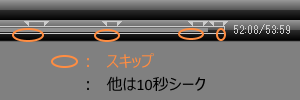
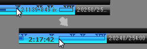
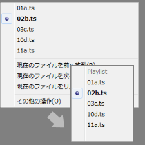


## TvtPlay_mod
   ・TVTest pluginのTvtPlayの改変版

-------------------------------------------------------------------------
### 変更点

* ”常に前面に表示”　→　”再生中のみ前面に表示”  
　に置き換え  

* ”次のチャプター”　→　”次の本編開始チャプター”  
　”前のチャプター”　→　”前の本編開始チャプター”  
　に置き換え

* ”SeekA”　→　”＋１０秒シーク、スキップチャプター直前のみスキップ”  
　に置き換え  

　通常は＋１０秒シーク  
　スキップチャプター直前の３０秒間はスキップ  
　スキップ間が短いと＋１０秒シーク  
　TvtPlay.iniのSeekAの設定は無視されます。  

* シークバーの表示変更  

  

* プレイリストメニューをシンプルなメニューに変更  
TvtPlay.ini  
Button00=0,Width=36,ListPopup,OpenPopup  
を追加してください。

  

 
* 同一フォルダ内のファイルをプレイリストに追加（２コまで）  

-------------------------------------------------------------------------
### 細かい変更点

* 引数に -TvtpAutoPlay追加  
起動時にPopupPatternを再生する。

* ポップアップ用のフォルダを追加  
TvtPlay.ini  
PopupPattern=D:\Rec0\\\*.ts  
PopupPattern1=E:\Rec1\\\*.ts  
PopupPattern2=%RecordFolder%*.ts  
を追加してください。

* 従来よりもプラグイン、ドライバを自動で有効にする範囲を拡大し、  
  引数に.ts .tslistがあるだけで再生する。  
  

* 引数が無いと常に無効状態で起動するのをやめた

* ドライバ切り替え時に再生速度を１．０倍速に戻す。  

* ファイル末尾へのシーク動作  
　”２秒前から再生”　→　”再生終了”

* チャプター：ogmを廃止してframeに置き換え

-------------------------------------------------------------------------
### fork  

xtne6f/TvtPlay  
<https://github.com/xtne6f/TvtPlay>  

### test environment  

TVTest 0.9.0  
DBCTRADO/TVTest  
<https://github.com/DBCTRADO/TVTest>  

