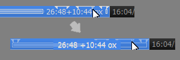

## TvtPlay_mod

TVTest pluginのTvtPlayの改変版

-------------------------------------------------------------------------
### 変更点

* ”常に前面に表示”　→　”再生中のみ前面に表示”  
　に置き換え  

* ”次のチャプター”　→　”次の本編開始チャプター”  
　”前のチャプター”　→　”前の本編開始チャプター”  
　に置き換え

* ”SeekA”　→　”＋１０秒シーク、スキップチャプター直前のみスキップ”  
　に置き換え  

　通常は＋１０秒シーク  
　スキップチャプター直前の３０秒間はスキップ  
　スキップ間が短いと＋１０秒シーク  
　TvtPlay.iniのSeekAの設定は無視されます。  

* シークバーの表示変更  

  

* プレイリストメニューをシンプルなメニューに変更  
TvtPlay.ini  
Button00=0,OpenPopup,ListPopup  

  

* TVTestを.tsの既定のプログラムにするだけで再生できるようした。  
  従来よりもプラグイン、ドライバを自動で有効にする範囲を拡大し、  
  引数に.ts .tslistがあるだけで再生する。  

  
* 同一フォルダ内のファイルをプレイリストに追加（２コまで）  

* ドライバ切り替え時に再生速度を１．０倍速に戻す。  

* ファイル末尾へのシーク動作　”２秒前から再生”　→　”再生終了”

* チャプター：ogmを廃止してframeに置き換え

-------------------------------------------------------------------------
### fork  

xtne6f/TvtPlay  
work-plus branch r121  
<https://github.com/xtne6f/TvtPlay>  

### test environment  

TVTest 0.9.0dev  
DBCTRADO/TVTest  
develop branch r643  
<https://github.com/DBCTRADO/TVTest>  
TVTest 0.8.1では動きません。

